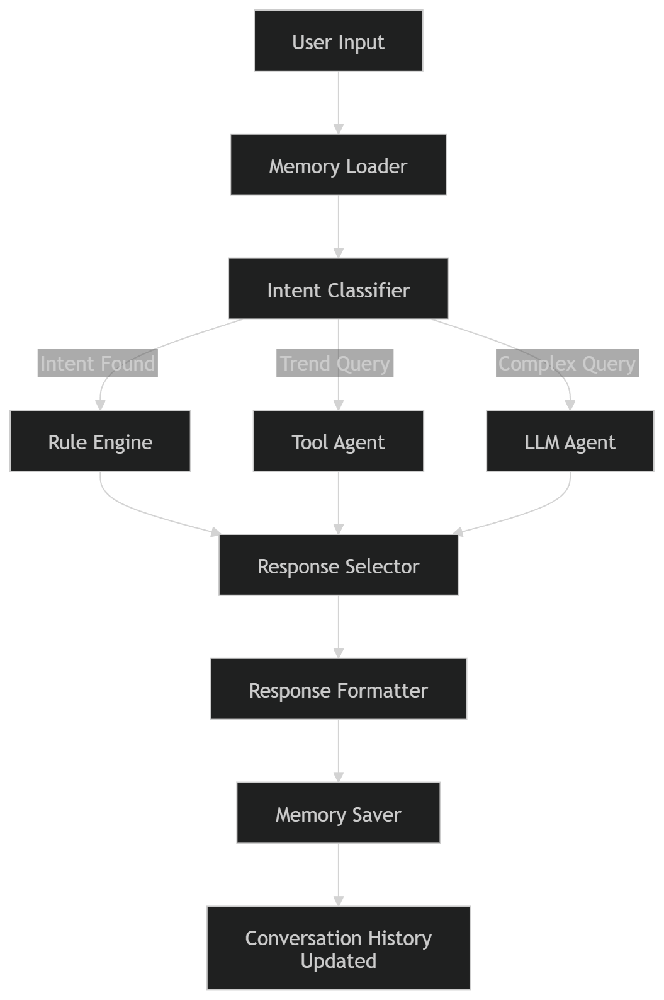

# 👗 Fashion AI Chatbot (Rule + LLM + Tools)

An intelligent fashion assistant that combines:
- Rule-based recommendations
- LLM-powered responses
- Real-time trend fetching via tools
- Memory-based contextual conversations

---

## 🚀 Architecture Overview

This chatbot follows a **hybrid pipeline**:

### 1. Rule Node
- Handles predefined intents (wedding, party, casual, blouse)
- Fast and deterministic responses
- Adds personalization using color & keywords

### 2. Tool Node
- Detects trend-related queries (e.g., "latest", "trending")
- Uses DuckDuckGo search for real-time fashion insights

### 3. LLM Node
- Generates contextual responses using:
  - Conversation memory
  - Current user input
- Handles complex or open-ended queries

### 🔄 Flow

User Input → Intent Detection →  
➡ Rule Node (if matched)  
➡ Tool Node (if trend-related)  
➡ LLM Node (fallback/enhancement)  
➡ Final Response

---

## 🧠 Memory Handling

- Stores past conversation history
- Passed into LLM as context
- Enables personalized and coherent responses

---

